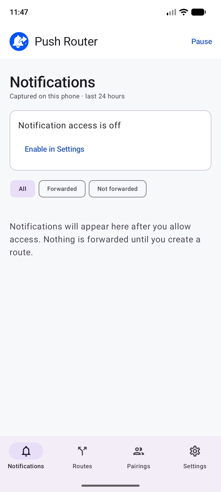
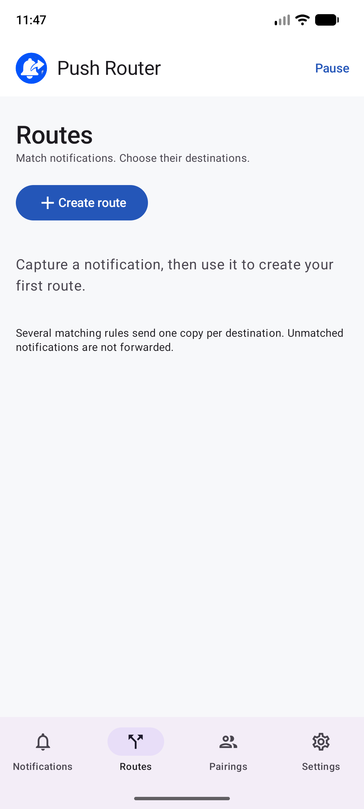
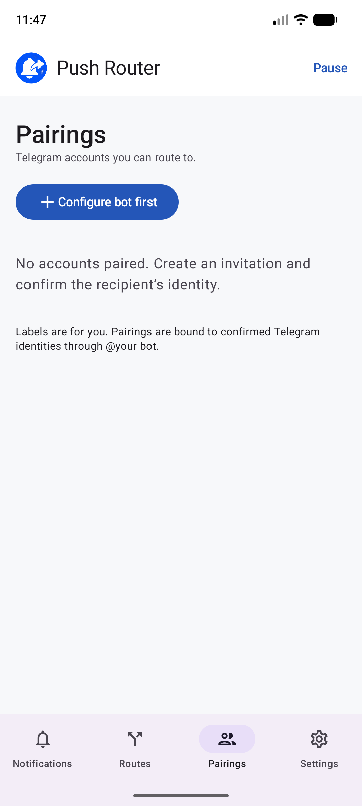
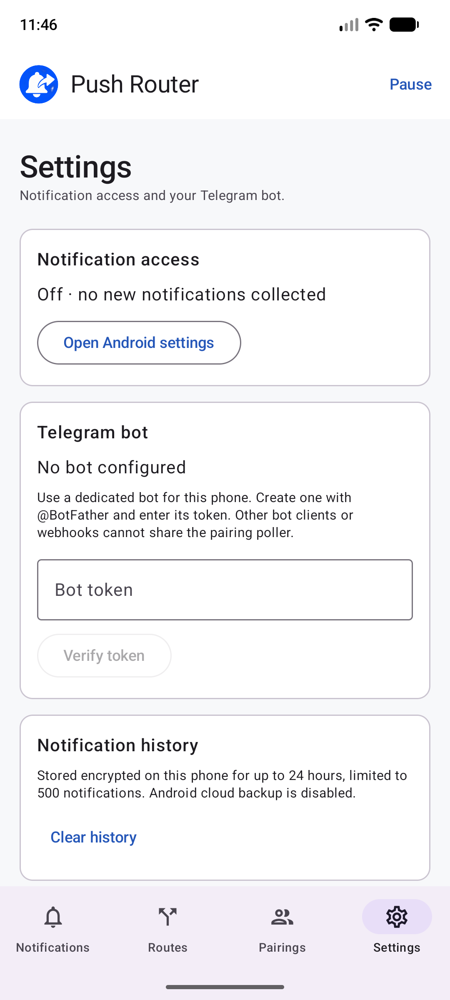

<p align="center">
  
</p>

# Push Router

**Your important Android notifications, delivered to Telegram.**

Follow phone alerts from your desktop or share selected updates with someone who needs them. Runs on your phone, with no forwarding server to deploy.

**Android 8.0+** · **Kotlin & Jetpack Compose**

[Get started](#get-started) · [Screenshots](#screenshots) · [Build and install](#build-and-install)

## Features

- **Selective routing:** match an app and Android profile, with optional category and case-insensitive title or message filters. Unmatched notifications stay local.
- **Multiple recipients:** send to one or more confirmed Telegram accounts. Overlapping routes send one copy per destination.
- **Preview and tracking:** test routes without sending messages and inspect delivery status.
- **Control:** pause individual routes or all forwarding, remove recipients, and clear history.

## Screenshots

The four main screens in light mode, before setup.

| Notifications | Routes | Pairings | Settings |
| --- | --- | --- | --- |
|  |  |  |  |

## Get started

1. [Build and install](#build-and-install) the app, then enable notification access via **Settings → Open Android settings**.
2. Create a dedicated bot with **[@BotFather](https://t.me/BotFather)**, without another polling client or webhook. Enter its token in Settings, select **Verify token**, then **Use this bot**.
3. In **Pairings**, create an invitation for yourself or another recipient. They scan the QR code or open the link and press **Start** in Telegram. Keep the pairing screen open and confirm their identity within five minutes.
4. Open a new captured notification and select **Route notifications like this**. Configure and save the route; it applies to future notifications only.

If Android blocks notification access, open **Android Settings → Apps → Push Router → ⋮ → Allow restricted settings**, then try again. Menu names vary by phone.

## Privacy and reliability

- Credentials, configuration, and history are encrypted locally with Android Keystore; Android cloud backup is disabled. Forwarded text goes directly to Telegram's Bot API over HTTPS and is visible to recipients.
- Offline deliveries wait for connectivity, and Telegram rate limits are retried. History is capped at **24 hours / 500 notifications**; removing a notification also removes its queued deliveries.
- Unconfirmed sends are not automatically resent, to avoid possible duplicates. Pausing cancels unauthorized queued deliveries; resuming does not replay them.
- Android background restrictions can delay forwarding. Hidden content cannot be forwarded, and recognized Telegram clients are excluded to prevent loops. Categories do not reliably distinguish accounts within an app.

## Build and install

Install Android Studio, **JDK 21**, **Android SDK Platform 36**, and **Platform-Tools**. Use JDK 21 as the Gradle JDK. For command-line builds, set `JAVA_HOME` to the JDK directory and `ANDROID_HOME` (or `sdk.dir` in `local.properties`) to the SDK directory.

```sh
./gradlew :app:assembleDebug
```

Enable **USB debugging**, connect one physical phone, and approve the debugging prompt. With `platform-tools` on your `PATH`, install the APK:

```sh
adb devices
adb -d install -r app/build/outputs/apk/debug/app-debug.apk
```

Alternatively, use **Run** in Android Studio or copy the APK to your phone and open it, allowing **Install unknown apps** if prompted.

## Feedback and contributions

[Report bugs or suggest features](https://github.com/krand/push-tg-router/issues) with your phone model, Android version, and steps to reproduce. Omit bot tokens and private notification content. Pull requests are welcome; check code changes with:

```sh
./gradlew :core:test :app:lintDebug
```

Find it useful? Star the repository or share it.
